# HVAC Reference Application Tutorial

This HVAC Reference Application is an interactive tutorial that allows users to learn the core features of Murano from both a hardware and software perspective. You will have the option to prototype or simulate the implementation of an HVAC monitoring system with simple controls using the Murano platform.

# Requirements
This tutorial is designed to be flexible based the hardware, software, and tools you have available. If you have one of the supported hardware items, you will be able to create a full IoT solution with working hardware. If you do not have any of the supported hardware available, we have created a Python based simulator that will help you get started.

## Supported Hardware

### SeeedStudio BeagleBone Green Wireless

[https://beagleboard.org/green-wireless](https://beagleboard.org/green-wireless)

SeeedStudio BeagleBone Green (BBG) is a low-cost, open-source, community-supported development platform for developers and hobbyists. It is a joint effort by BeagleBoard.org and Seeed Studio. It is based on the classical open-source hardware design of BeagleBone Black and has been developed into this differentiated version. The BBG includes two Grove connectors, making it easier to connect to the large family of Grove sensors. The onboard HDMI is removed to make room for these Grove connectors.

[http://wiki.seeed.cc/BeagleBone_Green/](http://wiki.seeed.cc/BeagleBone_Green/) 

### TI CC3200 SimpleLink™ Wi-Fi® and Internet-of-Things solution

The CC3200 device is a complete platform solution including software, sample applications, tools, user and programming guides, reference designs, and the TI E2E™ support community. The device is available in a QFN package that is easy to layout.

[http://www.ti.com/product/CC3200](http://www.ti.com/product/CC3200)

## Software

### MrMurano CLI

MrMurano CLI is a command-line utility for working with Murano. Think of it as a way to simplify and automate repetitious tasks for those who are comfortable with the command-line interface. 

[https://github.com/tadpol/MrMurano#mrmurano](https://github.com/tadpol/MrMurano#mrmurano)

### Git

Git is required to check out the source code used in this tutorial. Git is a source control tool widely used in the software industry. 

To install Git on your computer, please visit the link below and follow the instructions.

[https://git-scm.com/downloads](https://git-scm.com/downloads)

### Python

All code written for the simulator in this tutorial has been written to work with Python 2 and 3, which can be downloaded from the [Python website](https://www.python.org/).

### Web Browser

You'll need a web browser for the initial steps in this tutorial.

# Getting Started

In this section you will walk through the process of setting up your account with Murano and preparing to run the simulator or actual hardware. 

## Create an Account

To get started with this tutorial, you will need to create an Exosite account using your web browser of choice. 

1. If you do not have an Exosite account, you can sign up here ([https://exosite.com/signup/](https://exosite.com/signup/)).

   
   
   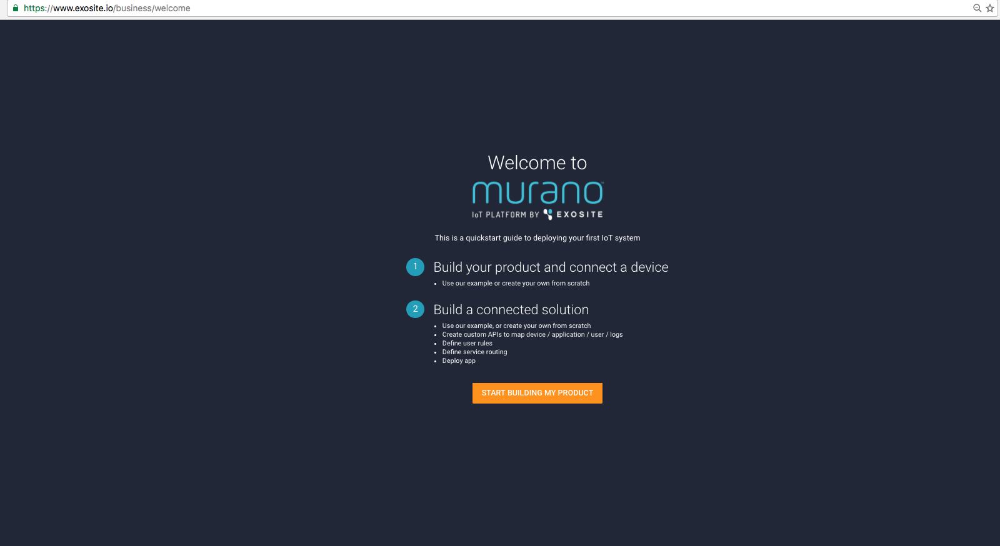

## Create Business

1. Once you have an active account and have logged in, you can navigate to the following URL to see your newly created business [https://www.exosite.io/business/memberships](https://www.exosite.io/business/memberships).

   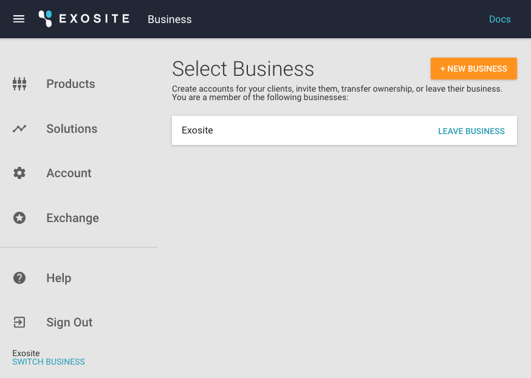

1. Click on your business to access your business page. 
   
## Install MrMurano CLI

Exosite offers a command line tool that allows you to efficiently work with the project in this tutorial. Even though everything in this tutorial can be accomplished using a the Web UI, feel free to install the MrMurano CLI.

```
MrMurano CLI is the command-line tool that interacts with Murano and makes tasks easier. MrMurano CLI makes it simple to deploy code to a solution, import many product definitions at once, set up endpoints and APIs, and more. 
```

MrMurano CLI is a Ruby based command-line interface. MrMurano CLI will be used for most actions throughout the rest of this tutorial.

Ruby is most likely already installed on your system. Check to see if Ruby is installed first by opening up a terminal window and typing the following command.  

**Note:** Always copy and paste what comes after the $.

```sh
$ which gem
```

If you see something like `/usr/bin/gem`, then Ruby is already installed. 

```
If you do not have Ruby installed, the official Ruby docs will help you get it installed:
[https://www.ruby-lang.org/en/documentation/installation/](https://www.ruby-lang.org/en/documentation/installation/) 
```

Once Ruby is installed, install MrMurano CLI by running this command:

```sh
$ sudo gem install MrMurano
```

If prompted, please enter your local computer password.

## Check Out the HVAC Demo Code

Git is required for this next step. Check if Git is installed by running the command: 

```sh
$ which git
```

```
If you do not have Git installed, the official Git docs will help you get it installed:
[https://git-scm.com/book/en/v2/Getting-Started-Installing-Git](https://git-scm.com/book/en/v2/Getting-Started-Installing-Git)
```

This tutorial uses a common codebase that includes a web application and specifications for the hardware. The code has been written to be flexible and works with multiple hardware platforms or the Python simulator.

In a terminal window, navigate to your development working directory and execute the following:

```sh
$ git clone https://github.com/exosite/hvac-reference-application.git
```

Enter your GitHub username and password if prompted.

Run this command:

```sh
$ cd hvac-reference-application
```

## Create a Solution

Next you need a place to deploy HVAC solution code. 

### Web UI

To create a solution using the Web UI:

1. From the *Solutions* tab (https://www.exosite.io/business/solutions), click "+ NEW SOLUTION." 

   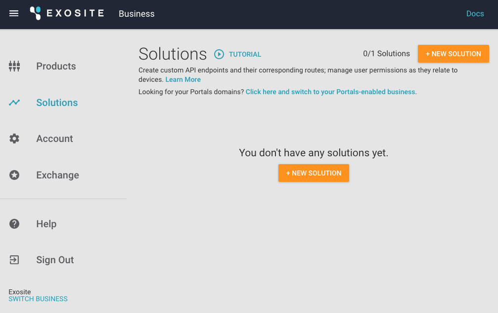

2. Select *Start from scratch* and click the "ADD" button.

   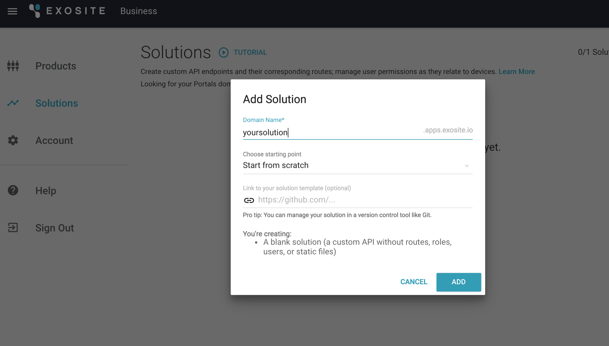

Once you have created a solution, you will need to find the Solution ID.

1. In Murano select *Solutions*.

2. Select the solution you just created.

3. Copy the Solution ID on this page.

   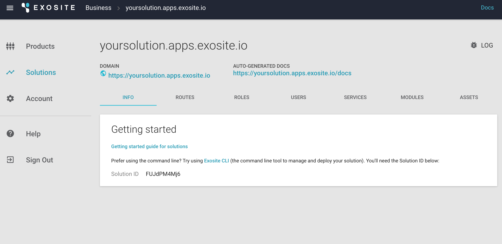

### MrMurano CLI

To create a solution using the MrMurano CLI:

```sh
$ mr solution create <name>
```

This command will return the ID of your solution for the next step.

### Configure Your Solution

To configure MrMurano CLI to work with your newly created solution, use the config command of the MrMurano CLI tool.

```sh
$ mr config solution.id <solutionid>
```

## Create a Product

Next, you will need to create a product. The product you create is the virtual representation of the BBG’s physical hardware and sensors that will send data to the Murano platform. 

### Web UI

To create a new product using the Web UI:

1. Navigate to the following URL: 
   [https://www.exosite.io/business/products](https://www.exosite.io/business/products)

   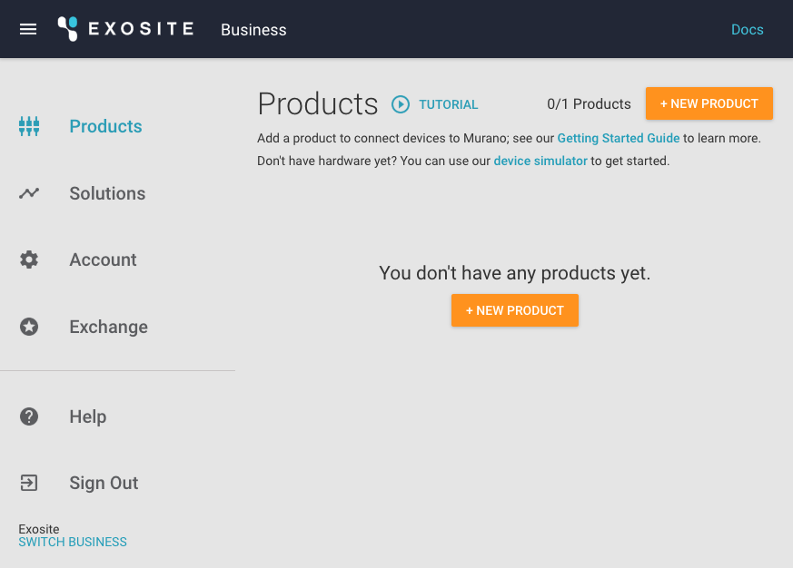

1. Click on "+ NEW PRODUCT." 

1. Name your product. Note: Your product name cannot contain any capital letters. 

1. Open the *Choose Starting Point* dropdown, select *Start from scratch*, and click the "ADD" button. In the next step you can use code to configure your product.

   

Before continuing you will need to find the ID of the product you created.

1. In Murano select *Products*.

2. Select the product you just created.

3. Copy the Product ID on this page.

   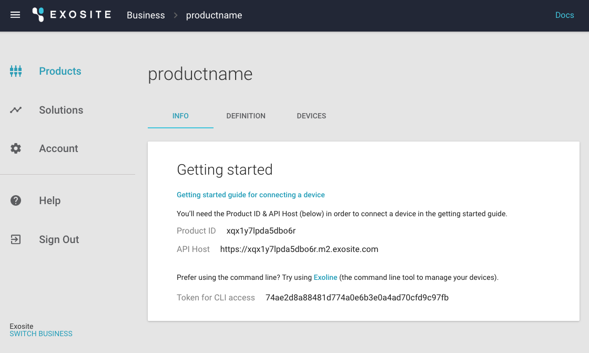


### MrMurano CLI

To create a new product using the MrMurano CLI:

```sh
$ mr product create <name>
```

This command will return the ID of your product for the next step.

## Configure Your Product

To configure your product you can use the config command of the MrMurano CLI tool. This command tells MrMurano CLI which product to use. 

```sh
$ mr config product.id <productid>
```

Executing the command below will set the product definition for this example as defined in the `specs/resources.yaml` file. 

```
$ mr syncup --specs
```
This command sets up all of the data aliases that we will use in this example. You can now see them by going to [https://www.exosite.io/business/products](https://www.exosite.io/business/products) and clicking the 'Definition' tab. Many of the aliases are used by Gateway Engine. Notice the aliases like 'ambient_temperature', 'desired_temperature', and 'heat_on'. These are all the different resources that will used for this HVAC tutorial. 

## Connect Product to Solution

Next, you will need to link your product with your solution. Linking allows your solution and product to communicate with one another.

### Web UI

1. In your Murano solution, click on the *SERVICES* tab. 

2. Select *Product*.

3. Select the settings icon. 

4. Select the product(s) you want to include in the solution. 

5. Click "APPLY".

   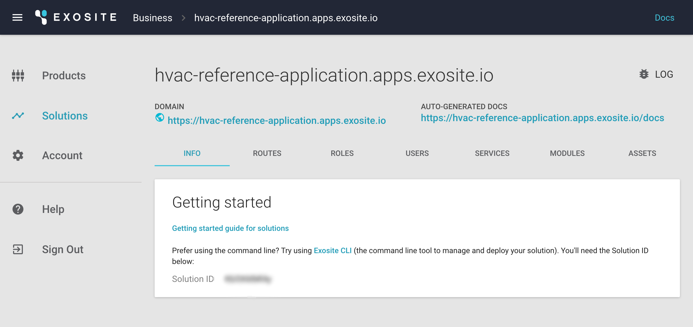

### MrMurano CLI

To connect a product with a solution using the MrMurano CLI:

```sh
$ mr assign set <product>
```

## Sync Your Solution

Before moving on to hardware, all of the configuration needs to be synced up to Murano.

```sh
$ mr syncup --all
```

```
What is happening when you sync code?

MrMurano CLI looks at the directory structure of your local repository and syncs the appropriate files and configurations directly to your solution in Murano. Endpoints, event handles, static files, and modules are synced. If you make changes locally, a syncup command will ensure Murano matches your local changes. If you make changes using the Murano interface, a syncdown will ensure your local repository matches Murano.
```

At this point your product and solution is configured and ready to start receiving data from your hardware of choice or the simulator. You can see the solution interface at this point by clicking the DOMAIN link on the Solution page.

## Next Steps

If you have hardware available, you can walk through installing required software on your hardware, connecting the hardware and its sensors to the Murano platform, and connecting the sensor data to a Murano solution.

If you do not have hardware available, you can walk through running the simulator. This should provide you with an easy starting point for connecting devices and creating solutions to visualize and interpret your device's data.

# BeagleBone Green Wireless

This portion of the tutorial with help you get your BeagleBone Green Wireless connected to the solution you have already deployed.

# Requirements

## Hardware Setup

### SeeedStudio BeagleBone Green Wireless

[https://beagleboard.org/green-wireless](https://beagleboard.org/green-wireless)

SeeedStudio BeagleBone Green (BBG) is a low-cost, open-source, community-supported development platform for developers and hobbyists. It is a joint effort by BeagleBoard.org and Seeed Studio. It is based on the classical open-source hardware design of BeagleBone Black and has been developed into this differentiated version. The BBG includes two Grove connectors, making it easier to connect to the large family of Grove sensors. The onboard HDMI is removed to make room for these Grove connectors.

[http://wiki.seeed.cc/BeagleBone_Green/](http://wiki.seeed.cc/BeagleBone_Green/) 

## Software Setup 

### Gateway Engine with GMQ

ExositeReady™ Gateway Engine (GWE) is a Python-based application framework that runs on embedded Linux gateway devices. GWE makes it easy to connect devices to a gateway and write applications on that gateway to interact with Exosite web services, including the Murano platform, Murano Edge, or both.

In this example you will use GWE to allow sensors to communicate with the Murano platform. Installation instructions are provided in a later section.

```
Gateway Engine will be used to provision, or activate your physical hardware.
```
# BeagleBone Setup

Plug in your BBG and sensor as shown below:

   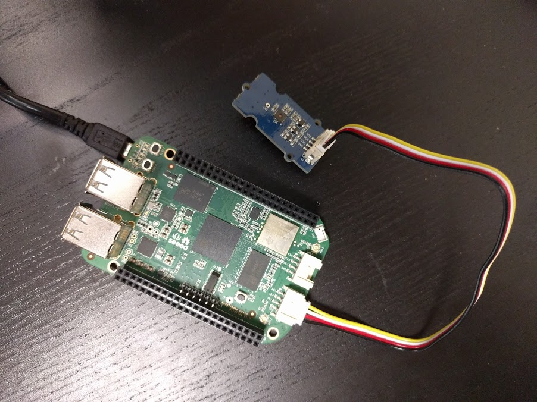

Using a smartphone or computer:

1.  Go to your Wi-Fi settings.

2.  Connect to the Wi-Fi signal named "Beaglebone <xxxx>".

3.  Follow the instructions on the screen to connect the BBG to your Wi-Fi network.

4.  Write down your BBG's IP address when the screen below is shown:

   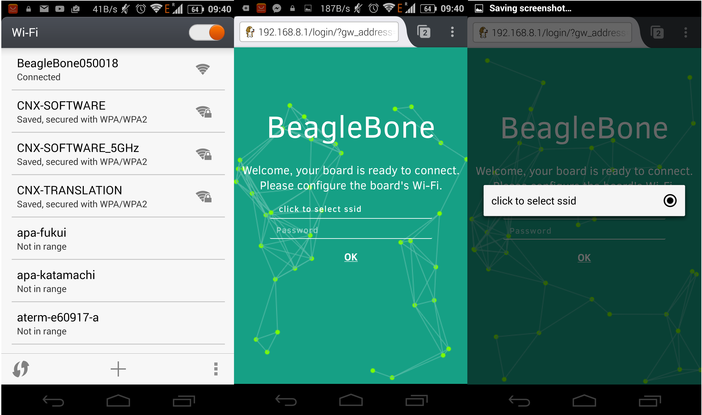
   
   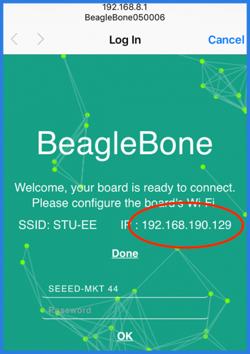

The BBG does not come with all the tools needed for reading sensors connected to it. Some initial setup is required to send sensor data to Exosite.

[http://beagleboard.org/static/beaglebone/latest/README.htm](http://beagleboard.org/static/beaglebone/latest/README.htm)

```
If at some point you want to start over and need to reset your device, the software and steps can be found here:

[http://elinux.org/Beagleboard:BeagleBoneBlack_Debian#microSD.2FStandalone:_.28iot.29_.28BeagleBone.2FBeagleBone_Black.2FBeagleBone_Green.29](http://elinux.org/Beagleboard:BeagleBoneBlack_Debian#microSD.2FStandalone:_.28iot.29_.28BeagleBone.2FBeagleBone_Black.2FBeagleBone_Green.29) 
```

[Reinstall BBGW](http://wiki.seeed.cc/BeagleBone_Green_Wireless/#update-to-latest-software)

Now, to connect directly to the BBG, you can use ssh. At this point you can update the board to install a few needed libraries. The password for the BBG will be displayed after you initiate the ssh connection.

```sh
$ ssh debian@<IP Address>
$ sudo apt-get update && sudo apt-get upgrade
```

After the upgrade completes, please restart the BBG before continuing the setup process.

```
$ sudo reboot
```

After the reboot, ssh back into the BBG to finish upgrading libraries.

```
$ ssh debian@<IP Address>
$ sudo pip install Adafruit_BBIO --upgrade
$ sudo pip install pyserial --upgrade
$ sudo apt-get install python-smbus
```

## Install GWE with GMQ on BeagleBone

Next install GWE on the BBG. 

```
What is GWE?

In the context of IoT, a "gateway" can be loosely defined as any device that serves as a communication broker for other devices. Gateways, in this context, often bridge the gap between an IoT platform (Exosite) and some collection of devices that do not possess the ability to communicate on the Internet. Sometimes the devices generating the data you want on the Internet are not devices, per se, but data from other networks the gateway can access such as modbus and CAN. Either way, the purpose of any gateway is to move local data to an external agent on the Internet.

Since using gateways is common throughout so many industrial applications, Exosite created Gateway Engine as an out-of-the-box developer and deployment tool for Internet-connected gateways.

For more information, check out the GWE docs site [http://docs.exosite.com/gwe/](http://docs.exosite.com/gwe/).
```

First write down the MAC address of the BBG for adding the device later.

```
$ ssh <USER>@<GATEWAY_IP> "ifconfig -a"
```

To download the latest version of the Public Release of GWE, follow these steps:

Navigate to the Gateway Engine Release Packages section and follow the instructions to download GWE.
Run these commands to copy GWE to your gateway (the actual filename in the command may differ):

```
$ ssh <USER>@<GATEWAY_IP> "mkdir /opt"
$ scp GatewayEngine.v1-1-2.tar.gz <USER>@<GATEWAY_IP>:/opt
```

At this point, you have downloaded the latest release of GWE and copied it to your gateway.
Run this command to untar the release package and install GWE onto your gateway:

```
$ ssh <USER>@<GATEWAY_IP> 
$ cd /opt
$ tar zxvf GatewayEngine.v1-1-2.tar.gz
$ cd gateway-engine
$ ./install.sh"
```
   
**Note:** In some Linux environments, you will need to use Super-User permissions to run the installer. In this case, replace the ./install.sh command to:

```
$ sudo ./install.sh
```

Once the installation completes, you will need to configure GWE for your IoT solution and Exosite account. This will require one piece of information from your Murano account.

In your Murano account, navigate to your Product and click on the *INFO* tab. Copy the Product ID and use it in the commands, below, in place of <PRODUCT_ID>.

```
$ ssh <USER>@<GATEWAY_IP> "gwe --set-product-id <PRODUCT_ID> --set-iface wlan0""
```

Example:

```
$ ssh <USER>@<GATEWAY_IP> "gwe --set-product-id dubhxzv0r4e1m7vj --set-iface eth0"``
```

To complete the installation you will need to reboot the gateway. To reboot, you can toggle the power or use the following command:

```
$ ssh <USER>@<GATEWAY_IP> "reboot"
```

At this point in the tutorial, your device’s software is up to date and ready to connect.

## Add Device

Now you will add your device to your product in Murano

1. In Murano select *Products*.

   

2. Select your product.

3. Select *DEVICES*.

   

4. Click "+ NEW DEVICE."

   

5. Add a device with a Name and Identity. The Name can be any string to help remember which device it is. The Identity should be the MAC address of your BBG.

## Enable Serial Number which is the MAC Address of the Device

At this point, you will need to activate your device by executing a command in GWE.

### GWE Activation

The steps to activate your BBG using GWE can be found here:
[http://docs.exosite.com/gwe/getting_started/](http://docs.exosite.com/gwe/getting_started/)

A summarized version of the steps are included here:

```
$ ssh debian@<IP Address>
$ sudo gwe --set-product-id <Product ID> --set-uuid <MAC Address>
$ sudo reboot
```

## Coding the sensors

The BBG needs to be able to talk to the Temp/Humidity sensor.

In a web browser, type in the IP address of the BBG in the following format:

```
http://xxx.xxx.xxx.xxx:3000/
```

Copy the code from TH02.py into the code area and click run. This will read data from the temperature and humidity sensor and send the data to your Murano solution.

# Python Simulator

This portion of the tutorial with help you run the Python simulator and connect the data to the solution you have already deployed.

# Requirements

### Python

All code written for the simulator in this tutorial has been written to work with Python, which can be downloaded from the [Python website](https://www.python.org/).

# Simulator Setup

The simulator requires Python. You can ensure Python is available on your system by executing the following command.

```sh
$ which python
```

If Python is not available, please follow the official documentation to get started:
[https://www.python.org/downloads/](https://www.python.org/downloads/)

In the `hvac-reference-application` folder, install requirements. The only requirement for this simulator is `requests`. The requests library is used for executing HTTP requests to Exosite and the Weather Underground API.

```sh
$ cd hvac-reference-application
$ pip install -r requirements.txt
```

Next you will need to obtain an API key from Weather Underground and configure the product scripts.

Navigate to Weather Underground and log in or sign up for an API key. All plans are free for development use, as such it makes sense to sign up for the ANVIL plan.

[https://www.wunderground.com/weather/api/](https://www.wunderground.com/weather/api/)

Once you obtain your API, add it to the `config.ini` file in the `product` folder.

```
[main]
cik =
wuapi = aen23n5215a235jkjh
```

The CIK value will be automatically added during the activation step below.

## Add Device

Now you will add your device to your product in Murano

1. In Murano select *Products*.

   

2. Select your product.

3. Select *DEVICES*.

   

4. Click "+ NEW DEVICE."

   

5. Add a device with a Name and Identity. The Name can be any string to help remember which device it is. The Identity can be `00001` for the purpose of testing with the Python simulator.

### Simulator Activation and Execution

At this point, you will need to activate your device by running the simulator code.

```
$ cd product
$ python3 ./hvac-simulator.py <product_id> <device_id>
```

The script will now pull historical data from the Weather Underground API to simulate weather. The "building" will heat and cool relative to the ambient temperature. After the temperature reaches a certain level, either the AC or HEAT will be activated. Adjustments to the temperature settings can be made from the solution interface.
